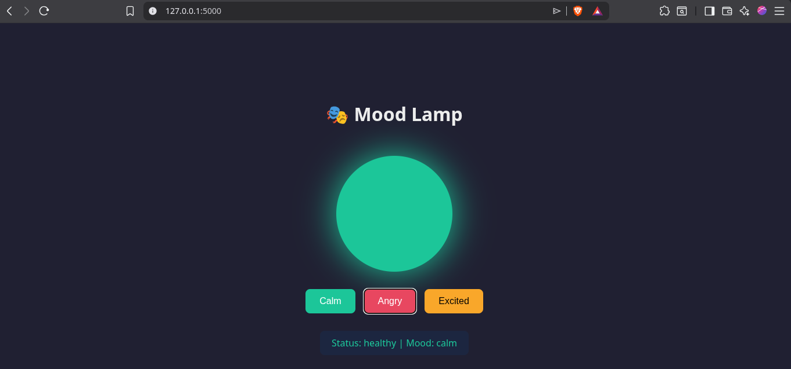
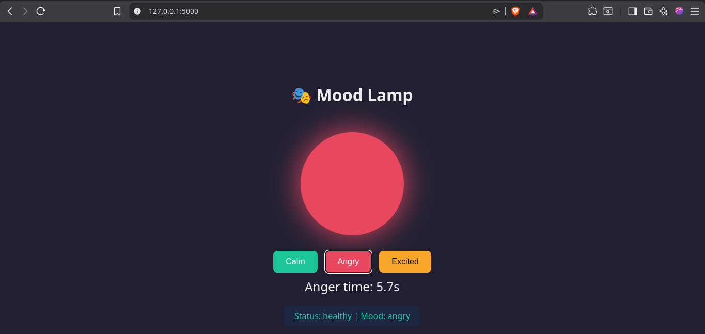
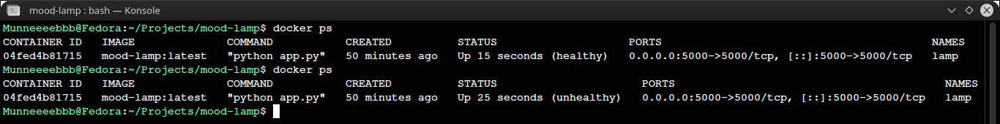
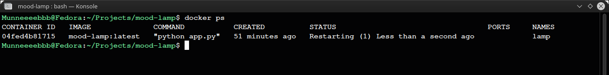

# Mood Lamp

A Flask application built to demonstrate how Docker **health checks** and **restart policies** work together to monitor application health and automatically recover from simulated application crashes.

---

## Features

- Toggle between **Calm**, **Angry**, and **Excited** moods
- Real-time anger timer
- Docker health monitoring using `HEALTHCHECK`
- Simulated application crash
- Automatic container recovery using Docker restart policies

---

## Docker Concepts Practiced

- Docker `HEALTHCHECK`
- Restart policies (`--restart=on-failure`)
- Container health monitoring
- Application crash simulation
- Automatic container recovery
- Process exit codes

---

## Health Check Timeline

| Time | Application State | Container Status |
|------|--------------------|------------------|
| 0s | Calm | Healthy |
| 5s | Angry selected | Healthy |
| 20s | Health check fails | Unhealthy |
| 30s | Application exits | Container stops |
| 31s | Restart policy starts a new container | Healthy |

---

## Screenshots

### 1. Healthy State
The application starts in a healthy state.



---

### 2. Angry State
The anger timer begins while the container remains healthy.



---

### 3. Health Transition
The terminal shows the container transitioning from **healthy** to **unhealthy** after consecutive failed health checks.



---

### 4. Automatic Recovery
After the application crashes, Docker automatically restarts the container according to the configured restart policy.



---

## Project Structure

```text
.
├── screenshots/
│   ├── healthy.png
│   ├── angry.png
│   ├── unhealthy.png
│   └── restarting.png
├── templates/
│   └── index.html
├── app.py
├── Dockerfile
├── requirements.txt
└── README.md
```

---

## Quick Start

Build the image:

```bash
docker build -t mood-lamp:latest .
```

Run the container:

```bash
docker run -d \
  --name lamp \
  --restart=on-failure \
  -p 5000:5000 \
  mood-lamp:latest
```

Open your browser:

```
http://localhost:5000
```

---

## Observe the Container Status

Monitor the container health in real time:

```bash
watch -n 2 'docker ps --format "table {{.Names}}\t{{.Status}}"'
```

You'll observe the following sequence:

```
healthy
    ↓
unhealthy
    ↓
container exits
    ↓
health: starting
    ↓
healthy
```

---

## Tech Stack

- Python 3.11
- Flask
- Docker

---

## Author

**Muneeb Ahmad Rather**